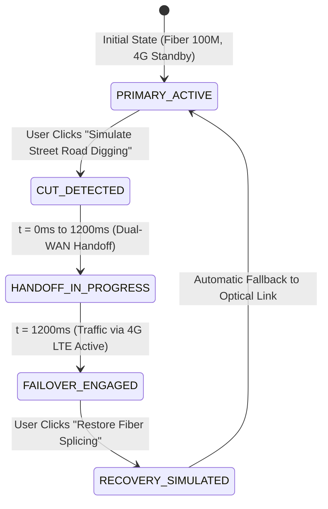

# Link3 Frontend Low-Level Design (LLD): Component Specifications & State Architecture
## Technical Implementation Blueprint for Core Wireframes & Interactive Simulators

**Document Code:** `05-WIRE-LLD-02`  
**Version:** 1.0  
**Date:** September 2026  
**Status:** Approved for Implementation  
**Companion Documents:**
- `01_core_flow_wireframes.md` (`05-WIRE-CORE-01` — Wireframe Blueprints)
- `04-insights/01_ux_decisions_and_feature_backlog.md` (`04-INSIGHTS-BACKLOG-01` — UX Decisions & Sprints)
- `02-personas/01_customer_personas.md` (`02-PERSONAS-01` — User Archetypes)

---

## 1. Executive Technical Overview

This Low-Level Design (LLD) translates the 11 low-to-mid fidelity wireframes defined in `01_core_flow_wireframes.md` into concrete, production-ready frontend specifications for Next.js App Router (`apps/web/src/`).

### 1.1 Technical Stack & Constraints
- **Framework:** Next.js 15+ (App Router, React 19 Server & Client Components)
- **Language:** TypeScript 5.5+ (Strict mode, zero `any` policy)
- **Styling Architecture:** Vanilla CSS + CSS Variables (`variables.css`, `globals.css`) scoped into component CSS files under `src/styles/components/`. No Tailwind CSS dependencies.
- **Iconography:** `lucide-react` (SVG micro-icons matching Link3 stroke weight standards)
- **Audio Synthesis:** Native Web Audio API (`AudioContext` dual oscillators for DTMF tone generation)
- **Telemetry Streaming:** Server-Sent Events (`EventSource`) with fallback to resilient polling
- **Currency & Localization:** Bangladeshi Taka (`৳` BDT, formatted via `Intl.NumberFormat('en-BD')`), English + Bangla bilingual support ready.

---

## 2. Directory Structure & Component Tree (`apps/web/src/`)

```text
apps/web/src/
├── app/
│   ├── layout.tsx                                # Root layout (SegmentBar + Navbar + Footer + FloatingChat)
│   ├── page.tsx                                  # Homepage (WF2 Dual-Intent Hero, WF3 Plan Selector, WF11 Coverage)
│   ├── bundles/
│   │   └── page.tsx                              # WF4: 3-Step "Build Your Bundle" Configurator
│   ├── coverage/
│   │   └── page.tsx                              # WF11: Interactive Coverage Map & Lead Qualification Gate
│   ├── home/
│   │   ├── page.tsx                              # WF3: Full Lifestyle Plan Grid & Addon Comparison
│   │   ├── fttr/
│   │   │   └── page.tsx                          # WF5: Interactive 3D FTTR Apartment Visualizer
│   │   └── gaming/
│   │       └── page.tsx                          # WF6: Gamer Pulse Hub & Low-Latency Matrix
│   └── business/
│       ├── page.tsx                              # B2B Segment Hub
│       ├── sme/
│       │   ├── page.tsx                          # WF7: Business Shield 4G Failover Simulator
│       │   └── cloudvoice/
│       │       └── page.tsx                      # WF8: CloudVoice Virtual PBX & IVR Simulator
│       └── enterprise/
│           └── page.tsx                          # WF9: Enterprise DIA & CyberDefend DDoS Scrubber
├── components/
│   ├── common/
│   │   ├── SegmentBar.tsx                        # Global Segment switcher + live BDIX chip (WF1)
│   │   ├── Navbar.tsx                            # Primary desktop/tablet navigation (WF1)
│   │   ├── MobileDrawer.tsx                      # Slide-out responsive navigation (WF1)
│   │   ├── Link3Logo.tsx                         # Optimized brand SVG logo
│   │   ├── Footer.tsx                            # Global BTRC-compliant corporate footer
│   │   └── FloatingChat.tsx                      # WhatsApp-First AI Self-Care Widget (WF10)
│   ├── home/
│   │   ├── HeroSection.tsx                       # Dual-intent hero container (WF2)
│   │   ├── DualIntentCard.tsx                    # Conversion tab switcher: New Connection vs Quick Pay (WF2)
│   │   ├── CoverageQuickCheck.tsx                # Quick address verification bar (WF2, WF11)
│   │   ├── QuickPayTab.tsx                       # 2-click bKash bill payment form (WF2, WF10)
│   │   ├── PlanSelector.tsx                      # 5-tier lifestyle broadband selector (WF3)
│   │   ├── PlanCard.tsx                          # Individual plan card with VAT-inclusive pricing (WF3)
│   │   └── CoverageSection.tsx                   # Dhaka metro coverage snapshot (WF11)
│   ├── bundles/
│   │   ├── BundleConfigurator.tsx                # 3-step configurator orchestrator (WF4)
│   │   ├── StepSpeed.tsx                         # Step 1: Optical speed tier selector (WF4)
│   │   ├── StepHardware.tsx                      # Step 2: 0% EasyPay hardware picker (WF4)
│   │   ├── StepOtt.tsx                           # Step 3: Entertainment & OTT packs (WF4)
│   │   ├── AddonDrawer.tsx                       # Expandable post-selection add-on drawer (WF4)
│   │   └── BundleSummarySticky.tsx               # Desktop sticky card / Mobile sticky bottom sheet (WF4)
│   ├── fttr/
│   │   ├── FttrVisualizer.tsx                    # Visualizer state orchestrator (WF5)
│   │   ├── IsometricFloorplan.tsx                # CSS/SVG 2.5D isometric cutaway apartment (WF5)
│   │   ├── RoomNode.tsx                          # Interactive clickable room hotspot (WF5)
│   │   ├── SignalSpeedGauge.tsx                  # Signal attenuation & speed odometer (WF5)
│   │   └── FttrFallbackBanner.tsx                # Smart Wi-Fi 6 Mesh fallback callout (WF5)
│   ├── gaming/
│   │   ├── GamingHub.tsx                         # Gaming zone container (WF6)
│   │   ├── LatencyMatrix.tsx                     # Live multi-server ping telemetry grid (WF6)
│   │   ├── PingTicker.tsx                        # Live animated ping pill with jitter (WF6)
│   │   ├── JitterChart.tsx                       # 24h packet jitter / latency visualizer (WF6)
│   │   └── BoosterPackCard.tsx                   # ৳99/mo gaming acceleration package toggle (WF6)
│   ├── business/
│   │   ├── sme/
│   │   │   ├── FailoverSimulator.tsx             # 4G LTE failover simulation orchestrator (WF7)
│   │   │   ├── TopologyDiagram.tsx               # Primary vs 4G dual-WAN animated diagram (WF7)
│   │   │   ├── CutTriggerButton.tsx              # Interactive "Sever Street Fiber" switch (WF7)
│   │   │   └── FinancialImpactGauge.tsx          # POS uptime & revenue saved calculator (WF7)
│   │   ├── cloudvoice/
│   │   │   ├── CloudVoiceSimulator.tsx           # PBX interactive experience container (WF8)
│   │   │   ├── DtmfKeypad.tsx                    # Interactive audio phone dial pad (WF8)
│   │   │   ├── CallFlowDiagram.tsx               # Dynamic routing tree from IVR to extensions (WF8)
│   │   │   └── ExtensionPacks.tsx                # Commercial extension tier selector (WF8)
│   │   └── enterprise/
│   │       ├── CyberDefendScrubber.tsx           # DDoS mitigation pipeline container (WF9)
│   │       ├── TrafficSankey.tsx                 # Volumetric attack vs clean pipe flow visual (WF9)
│   │       ├── MitigationTelemetry.tsx           # Real-time packet inspection metrics (WF9)
│   │       └── RfpGeneratorModal.tsx             # 1-click B2B proposal PDF download modal (WF9)
│   └── coverage/
│       ├── CoverageMap.tsx                       # Interactive Dhaka fiber node map (WF11)
│       ├── AddressAutocomplete.tsx               # Road/Sector predictive search input (WF11)
│       ├── QualificationResultCard.tsx           # State A/B/C outcome container (WF11)
│       └── EarlyAccessForm.tsx                   # State C lead reservation form (WF11)
├── styles/
│   ├── variables.css                             # Design tokens (colors, fonts, radii, elevations)
│   ├── globals.css                               # Root reset, layout, and component CSS imports
│   └── components/
│       ├── segment-bar.css                       # Styles for WF1
│       ├── navbar.css                            # Styles for WF1
│       ├── hero.css                              # Styles for WF2
│       ├── plans.css                             # Styles for WF3
│       ├── bundles.css                           # Styles for WF4
│       ├── fttr.css                              # Styles for WF5
│       ├── gaming.css                            # Styles for WF6
│       ├── sme-failover.css                      # Styles for WF7
│       ├── cloudvoice.css                        # Styles for WF8
│       ├── enterprise-ddos.css                   # Styles for WF9
│       ├── floating-chat.css                     # Styles for WF10
│       └── coverage.css                          # Styles for WF11
├── data/
│   ├── site.ts                                   # Global navigation, social, footer links
│   ├── plans.ts                                  # 5 lifestyle broadband plans (BDT ৳, VAT inclusive)
│   ├── bundles.ts                                # Speed tiers, EasyPay hardware, OTT packages
│   ├── gaming.ts                                 # Regional game servers, IP nodes, initial pings
│   ├── coverage.ts                               # Dhaka metro zones, building statuses, fallback rules
│   ├── business.ts                               # SME failover specs, PBX extensions, DIA bandwidths
│   └── faqs.ts                                   # Lifestyle, FTTR, and enterprise FAQs
├── types/
│   ├── plan.types.ts                             # Lifestyle plan & addon interfaces
│   ├── bundle.types.ts                           # Configurator selection state & pricing model
│   ├── telemetry.types.ts                        # Ping, jitter, and network pulse models
│   ├── coverage.types.ts                         # Building query, status enum, lead submission
│   ├── business.types.ts                         # Failover state, IVR route, enterprise RFP
│   └── care.types.ts                             # WhatsApp AI quick action payloads
└── lib/
    ├── pricingEngine.ts                          # Transparent pricing, EasyPay EMI, 15% VAT math
    ├── telemetryEngine.ts                        # Gaussian ping simulation & jitter calculations
    ├── audioSynthesizer.ts                       # Web Audio API DTMF dual-oscillator frequency generator
    └── formatters.ts                             # BDT currency (৳), speed (Mbps/Gbps), phone formatting
```

---

## 3. Core Data Contracts & TypeScript Interfaces

### 3.1 Plan & Pricing Domain (`src/types/plan.types.ts`)
```typescript
export type PlanTierId = 'lite' | 'home' | 'prime' | 'ultra' | 'max';

export interface PlanFeature {
  id: string;
  label: string;
  isHero?: boolean;
  tooltip?: string;
}

export interface LifestylePlan {
  id: PlanTierId;
  name: string;
  tagline: string;
  targetAudience: string;
  speedMbps: number;
  uploadSymmetrical: boolean;
  monthlyFeeBdt: number;          // Total price inclusive of 15% VAT
  baseFeeExcludingVat: number;    // Calculated: monthlyFeeBdt / 1.15
  vatAmountBdt: number;           // Calculated: monthlyFeeBdt - baseFeeExcludingVat
  deviceCapacity: string;
  routerIncluded: string;
  fttrEligible: boolean;
  fttrAddonBdt: number;
  popular?: boolean;
  features: PlanFeature[];
  badgeText?: string;
}
```

### 3.2 Bundle Configurator Domain (`src/types/bundle.types.ts`)
```typescript
export interface SpeedOption {
  id: string;
  speedMbps: number;
  name: string;
  priceBdt: number;               // Monthly fee
  popular?: boolean;
}

export interface HardwareItem {
  id: string;
  name: string;
  brand: string;
  category: 'tv' | 'mesh' | 'console' | 'camera';
  monthlyEmiBdt: number;          // 24-Month 0% Interest EMI
  fullRetailBdt: number;
  specs: string[];
  imageUrl: string;
}

export interface OttPack {
  id: string;
  name: string;
  priceBdt: number;
  platforms: string[];            // e.g. ['Chorki', 'Hoichoi', 'Toffee']
  badge?: string;
  description: string;
}

export interface ProtectionAddon {
  id: string;
  name: string;
  monthlyBdt: number;
  description: string;
  category: 'security' | 'cloud' | 'parental';
}

export interface BundleSelectionState {
  selectedSpeedId: string;
  selectedHardwareIds: string[];
  selectedOttIds: string[];
  selectedAddonIds: string[];
}

export interface BundleCalculationResult {
  speedCostBdt: number;
  hardwareCostBdt: number;
  ottCostBdt: number;
  addonCostBdt: number;
  standaloneTotalBdt: number;
  bundleDiscountBdt: number;
  finalMonthlyBdt: number;        // All-inclusive monthly payable
  totalMonthlySavingsBdt: number;
  effectiveVatBdt: number;
}
```

### 3.3 Network Telemetry & Gamer Domain (`src/types/telemetry.types.ts`)
```typescript
export type TelemetryStatus = 'OPTIMAL' | 'FAIR' | 'DEGRADED';

export interface GameServerNode {
  id: string;
  name: string;
  region: string;
  targetIpOrHost: string;
  baseLatencyMs: number;
  currentLatencyMs: number;
  jitterMs: number;
  packetLossPercent: number;
  status: TelemetryStatus;
  gameTitle?: string;             // e.g. 'Valorant SG', 'Dota 2 / Steam'
}

export interface NetworkPulseTelemetry {
  bdixLatencyMs: number;
  awsSingaporeLatencyMs: number;
  riotSingaporeLatencyMs: number;
  steamSingaporeLatencyMs: number;
  mumbaiLatencyMs: number;
  cloudflareDnsLatencyMs: number;
  last24hAverageJitterMs: number;
  antiDdosStatus: 'ACTIVE' | 'STANDBY';
  timestamp: string;
}
```

### 3.4 Coverage Domain (`src/types/coverage.types.ts`)
```typescript
export type CoverageStatus = 'FTTR_READY' | 'STANDARD_FTTH' | 'OUT_OF_FOOTPRINT';

export interface BuildingCoverageResult {
  addressQuery: string;
  matchedArea: string;
  zoneCode: string;
  status: CoverageStatus;
  fttrAvailable: boolean;
  availableSpeedTiers: number[];
  estimatedDeliveryHours: number;
  recommendedPlanId: PlanTierId;
  fallbackDescription?: string;
  leadPromoBenefit?: string;
}

export interface CoverageLeadSubmission {
  address: string;
  fullName: string;
  mobileNumber: string;
  email?: string;
  preferredSpeedMbps: number;
  notes?: string;
}
```

---

## 4. Component-by-Component Low-Level Specifications (WF1 to WF11)

---

### 4.1 Wireframe 1: Global Navigation & SegmentBar Architecture (WF1)

#### 4.1.1 Component Tree & File Mapping
- Container: `SegmentBar.tsx` (`src/components/common/SegmentBar.tsx`)
- Navigation: `Navbar.tsx` (`src/components/common/Navbar.tsx`)
- Mobile Drawer: `MobileDrawer.tsx` (`src/components/common/MobileDrawer.tsx`)
- Styles: `segment-bar.css`, `navbar.css`

#### 4.1.2 Props & State Specifications
```typescript
export type UserSegment = 'residential' | 'enterprise' | 'care';

export interface SegmentBarProps {
  currentSegment: UserSegment;
  onSegmentChange?: (segment: UserSegment) => void;
  telemetryPulse: NetworkPulseTelemetry;
}

export interface NavbarProps {
  currentPath: string;
  onOpenCoverageModal: () => void;
  onOpenQuickPayModal: () => void;
}

export interface MobileDrawerProps {
  isOpen: boolean;
  onClose: () => void;
  currentSegment: UserSegment;
  onSelectSegment: (segment: UserSegment) => void;
}
```

#### 4.1.3 Interaction State Machine & Behavior
- **Segment Switching:** When toggling from *Residential* to *Enterprise*, the active segment pill smoothly slides via CSS `transform: translateX()`. Main nav links instantly swap from Residential (`/home`, `/bundles`, `/home/fttr`, `/home/gaming`) to Enterprise (`/business/sme`, `/business/cloudvoice`, `/business/enterprise`).
- **Telemetry Chip:** Renders green pulsing dot (`--status-live: #10B981`) with `BDIX Pulse: 1.8ms`. Updates via SSE/interval every 5,000ms. If ping exceeds 10ms, dot changes to warning amber (`--status-warning: #F59E0B`).
- **Mobile Drawer:** Triggered by hamburger button at `< 1024px`. Drawer slides in from right (`transform: translateX(0)` with backdrop blur `backdrop-filter: blur(12px)`). Traps focus; `Escape` key closes drawer.

---

### 4.2 Wireframe 2: Dual-Intent Homepage Hero & Conversion Hub (WF2)

#### 4.2.1 Component Tree & File Mapping
- Parent Container: `HeroSection.tsx` (`src/components/home/HeroSection.tsx`)
- Child Components:
  - `DualIntentCard.tsx` (Tab switcher & form container)
  - `CoverageQuickCheck.tsx` (Tab 1: Predictive address search)
  - `QuickPayTab.tsx` (Tab 2: 1-click bKash bill payment)
- Styles: `hero.css`

#### 4.2.2 State Architecture & Reducer
```typescript
export type HeroTab = 'NEW_CONNECTION' | 'QUICK_PAY';

export interface HeroState {
  activeTab: HeroTab;
  addressSearchQuery: string;
  addressSuggestions: string[];
  isSearching: boolean;
  selectedBuilding: BuildingCoverageResult | null;
  // Quick Pay fields
  subscriberIdOrPhone: string;
  verifiedAmountBdt: number | null;
  paymentGatewayState: 'IDLE' | 'FETCHING_BILL' | 'BILL_FOUND' | 'PROCESSING_BKASH' | 'ERROR';
  errorMessage: string | null;
}
```

#### 4.2.3 Interaction Flow & Mobile Optimization
- **Desktop Grid (1280px):** 2-column layout. Left column (7 cols) displays brand proposition: *"Bangladesh's Pure Glass Network — Gigabit Optical Fibre Delivered Room-by-Room"* + Live BDIX pill + CTAs. Right column (5 cols) hosts `DualIntentCard`.
- **Mobile Viewport (390px):** **Conversion-First Inversion**. `DualIntentCard` renders *above* the editorial headline so that 78% of visitors with purchase/payment intent can interact without scrolling.
- **Tab 1 (New Connection):** User types building or road name. Debounced (250ms) lookup queries `coverage.ts`. Selecting an address triggers instantaneous qualification feedback (e.g. `🟢 Sector 4 is 100% FTTR Ready`).
- **Tab 2 (Quick Pay):** User inputs 11-digit mobile number (`01XXXXXXXXX`) or Link3 User ID. Auto-validates regex `/^(?:\+88|88)?(01[3-9]\d{8})$/`. If valid, displays outstanding monthly bill and renders dynamic bKash checkout button.

---

### 4.3 Wireframe 3: Lifestyle Plan Selector (`/home`) (WF3)

#### 4.3.1 Component Tree & File Mapping
- Parent: `PlanSelector.tsx` (`src/components/home/PlanSelector.tsx`)
- Child: `PlanCard.tsx` (`src/components/home/PlanCard.tsx`)
- Data: `src/data/plans.ts`
- Styles: `plans.css`

#### 4.3.2 Props & State Specifications
```typescript
export interface PlanSelectorProps {
  initialTiers?: LifestylePlan[];
  onSelectPlan: (plan: LifestylePlan) => void;
  selectedPlanId?: PlanTierId;
}

export interface PlanCardProps {
  plan: LifestylePlan;
  isSelected: boolean;
  onSelect: () => void;
  onToggleFttrAddon?: (enabled: boolean) => void;
}
```

#### 4.3.3 The 5 Lifestyle Tiers
| Tier | Speed | All-In Price | Base Price | 15% VAT | Target Audience & Key Inclusions |
|:-----|:------|:-------------|:-----------|:--------|:---------------------------------|
| **Link3 Lite** | 60 Mbps | ৳650/mo | ৳565.22 | ৳84.78 | 1-2 Users, Students; Wi-Fi 5/6 Router, BDIX 100M |
| **Link3 Home** | 100 Mbps | ৳1,000/mo | ৳869.57 | ৳130.43 | 4-Person Family, 4K Smart TV; Gigabit Optical ONT |
| **Link3 Prime** *(Hero)* | 200 Mbps | ৳1,500/mo | ৳1,304.35 | ৳195.65 | Symmetrical WFH & Power Users; Wi-Fi 6 Mesh, CloudVault 500GB |
| **Link3 Ultra** | 500 Mbps | ৳2,500/mo | ৳2,173.91 | ৳326.09 | Esports Gamers & Streamers; Free Static IP, UDP QoS |
| **Link3 Max** | 1,000 Mbps | ৳4,000/mo | ৳3,478.26 | ৳521.74 | Smart Villas & Multi-Device; Full FTTR Optical Kit included |

#### 4.3.4 Mobile Responsive Behavior (Horizontal Snap Carousel)
- On desktop (1280px), renders a 5-column grid with `Link3 Prime` highlighted via elevated border (`box-shadow: 0 0 24px rgba(0, 82, 255, 0.25)`).
- On mobile (390px), collapses into a CSS scroll-snap carousel (`scroll-snap-type: x mandatory`). Adjacent plan cards peek out by 24px on either edge, providing visual affordance that more plans are swipeable.

---

### 4.4 Wireframe 4: 3-Step "Build Your Bundle" Configurator (`/bundles`) (WF4)

#### 4.4.1 Component Tree & File Mapping
- Parent Orchestrator: `BundleConfigurator.tsx` (`src/components/bundles/BundleConfigurator.tsx`)
- Sub-components:
  - `StepSpeed.tsx` (Step 1: Speed tier selector)
  - `StepHardware.tsx` (Step 2: EasyPay 0% interest hardware cards)
  - `StepOtt.tsx` (Step 3: Entertainment streaming packs)
  - `AddonDrawer.tsx` (Collapsible SmartCam / Parental Shield drawer)
  - `BundleSummarySticky.tsx` (Real-time recalculating price card / mobile sticky sheet)
- Styles: `bundles.css`

#### 4.4.2 State Machine & Calculation Logic
```typescript
export interface ConfiguratorState {
  currentStep: 1 | 2 | 3;
  speedTierId: string;
  selectedHardwareIds: Set<string>;
  selectedOttIds: Set<string>;
  selectedAddonIds: Set<string>;
  isAddonDrawerExpanded: boolean;
}

export type ConfiguratorAction =
  | { type: 'SET_STEP'; step: 1 | 2 | 3 }
  | { type: 'SELECT_SPEED'; speedId: string }
  | { type: 'TOGGLE_HARDWARE'; hardwareId: string }
  | { type: 'TOGGLE_OTT'; ottId: string }
  | { type: 'TOGGLE_ADDON'; addonId: string }
  | { type: 'TOGGLE_ADDON_DRAWER' }
  | { type: 'RESET_CONFIGURATOR' };
```

#### 4.4.3 Pricing Engine Formula
$$\text{Standalone Total} = P_{\text{speed}} + \sum P_{\text{hardware}} + \sum P_{\text{OTT}} + \sum P_{\text{addon}}$$

$$\text{Ecosystem Discount} = \begin{cases} 
0 & \text{if } N_{\text{hardware}} = 0 \land N_{\text{OTT}} = 0 \\
৳150 & \text{if } N_{\text{hardware}} \ge 1 \land N_{\text{OTT}} = 0 \\
৳180 & \text{if } N_{\text{hardware}} = 0 \land N_{\text{OTT}} \ge 1 \\
৳280 + (N_{\text{hardware}} - 1) \times ৳50 & \text{if } N_{\text{hardware}} \ge 1 \land N_{\text{OTT}} \ge 1
\end{cases}$$

$$\text{Final Monthly Payable} = \text{Standalone Total} - \text{Ecosystem Discount}$$

*All display prices include 15% VAT.*

#### 4.4.4 Sticky Bottom Bar (Mobile 390px)
- The summary sheet docks at the bottom of the viewport with a high z-index (`z-index: 100`).
- Displays: `Total: ৳2,269/mo (Save ৳380)` + full-width thumb button `Complete Bundle (Step 2/3) →`.
- Tapping the price summary expands a modal sheet detailing line-item additions and discounts.

---

### 4.5 Wireframe 5: Interactive 3D FTTR Apartment Visualizer (`/home/fttr`) (WF5)

#### 4.5.1 Component Tree & File Mapping
- Parent Container: `FttrVisualizer.tsx` (`src/components/fttr/FttrVisualizer.tsx`)
- Sub-components:
  - `IsometricFloorplan.tsx` (Interactive SVG 2.5D cutaway apartment)
  - `RoomNode.tsx` (Clickable room hotspot with live signal stats)
  - `SignalSpeedGauge.tsx` (Real-time speed & latency dial)
  - `FttrFallbackBanner.tsx` (FTTR Ready vs Mesh substitution notice)
- Styles: `fttr.css`

#### 4.5.2 Room Topology Model & Node Specifications
```typescript
export interface ApartmentRoom {
  id: 'living-room' | 'master-bedroom' | 'kids-study' | 'balcony-patio';
  name: string;
  deviceRole: 'MASTER_ONT' | 'SUB_ONT' | 'WIFI_CLIENT';
  hardwareInstalled: string;
  speedDownMbps: number;
  speedUpMbps: number;
  latencyMs: number;
  jitterMs: number;
  signalStrengthDbm: number;       // Optical signal strength: e.g. -18.2 dBm
  activeShields: string[];         // e.g. ['Parental Shield', '4K Priority']
  svgCoordinates: { x: number; y: number; width: number; height: number };
}
```

#### 4.5.3 Interaction & Fallback State Handling
- **Interactive Cutaway:** Users click between *Master Bedroom*, *Living Room (Hub)*, and *Kids' Study*. The active room glows with cyan optical illumination (`filter: drop-shadow(0 0 12px #00F0FF)`). The right panel updates with exact speed test dials (940 Mbps symmetrical in bedroom vs standard Wi-Fi drop to 80 Mbps).
- **Invisible Micro-Fiber Animation:** Rendered via animated SVG stroke dash (`stroke-dasharray`, `stroke-dashoffset`) simulating light pulses traveling from Master ONT to Sub-ONTs along baseboard conduits.
- **Intelligent Fallback Banner:** If address checker determined the user's building is not yet FTTR optical-certified, the visualizer automatically replaces the optical sub-unit with a **Wi-Fi 6 Mesh 2-Pack (+৳320/mo)** and explains Link3's whole-home zero-dead-zone guarantee.

---

### 4.6 Wireframe 6: Gamer Low-Latency Hub (`/home/gaming`) (WF6)

#### 4.6.1 Component Tree & File Mapping
- Parent Container: `GamingHub.tsx` (`src/components/gaming/GamingHub.tsx`)
- Sub-components:
  - `LatencyMatrix.tsx` (Live multi-server ping grid)
  - `PingTicker.tsx` (Animated ping pill with randomized micro-jitter)
  - `JitterChart.tsx` (Canvas / SVG 24h stability graph showing 0.4ms flatline)
  - `BoosterPackCard.tsx` (৳99/mo gaming booster pack card)
- Data: `src/data/gaming.ts`
- Styles: `gaming.css`

#### 4.6.2 Live Telemetry Nodes & Refresh Engine
```typescript
export const DEFAULT_GAME_SERVERS: GameServerNode[] = [
  { id: 'bdix', name: 'National BDIX Peering', region: 'Dhaka', targetIpOrHost: '103.230.104.1', baseLatencyMs: 1.6, currentLatencyMs: 1.6, jitterMs: 0.2, packetLossPercent: 0, status: 'OPTIMAL' },
  { id: 'aws-sg', name: 'Singapore AWS (ap-southeast-1)', region: 'Singapore', targetIpOrHost: '13.228.0.0', baseLatencyMs: 25.8, currentLatencyMs: 25.8, jitterMs: 0.4, packetLossPercent: 0, status: 'OPTIMAL' },
  { id: 'riot-sg', name: 'Riot Valorant SG Server', region: 'Singapore', targetIpOrHost: '151.106.248.1', baseLatencyMs: 29.4, currentLatencyMs: 29.4, jitterMs: 0.5, packetLossPercent: 0, status: 'OPTIMAL', gameTitle: 'Valorant' },
  { id: 'valve-sg', name: 'Valve Steam Singapore', region: 'Singapore', targetIpOrHost: '103.10.124.1', baseLatencyMs: 31.2, currentLatencyMs: 31.2, jitterMs: 0.6, packetLossPercent: 0, status: 'OPTIMAL', gameTitle: 'Dota 2 / CS2' },
  { id: 'riot-in', name: 'Mumbai AWS / Riot India', region: 'Mumbai', targetIpOrHost: '13.126.0.0', baseLatencyMs: 26.1, currentLatencyMs: 26.1, jitterMs: 0.3, packetLossPercent: 0, status: 'OPTIMAL', gameTitle: 'Valorant / BGMI' },
  { id: 'cf-dns', name: 'Cloudflare Anycast DNS', region: 'Dhaka Node', targetIpOrHost: '1.1.1.1', baseLatencyMs: 1.1, currentLatencyMs: 1.1, jitterMs: 0.1, packetLossPercent: 0, status: 'OPTIMAL' }
];
```

#### 4.6.3 Telemetry Physics Simulation
Every 5,000ms, client executes `telemetryEngine.ts`:
$$P_{\text{current}} = P_{\text{base}} + \Delta_{\text{jitter}}, \quad \Delta_{\text{jitter}} \sim \mathcal{N}(0, \sigma^2)$$
Values animate smoothly with tabular numerals (`font-family: 'JetBrains Mono'`) without causing DOM reflow.

#### 4.6.4 Gaming Booster Pack Checkbox Features
- Prioritized UDP gaming traffic QoS (`dscp: 46 / EF`)
- 1 Free Public Static IPv4 address included (eliminates double-NAT for PlayStation & Xbox)
- Open NAT port forwarding pre-configured
- BDIX Game Patching direct cache (downloads 40GB game updates at 100 Mbps BDIX speeds)
- 1-Click CTA: **Link3 Ultra Gamer Plan (500M) ৳2,500 + Booster ৳99 = ৳2,599/mo**

---

### 4.7 Wireframe 7: SME "Business Shield" 4G Failover Simulator (`/business/sme`) (WF7)

#### 4.7.1 Component Tree & File Mapping
- Parent Container: `FailoverSimulator.tsx` (`src/components/business/sme/FailoverSimulator.tsx`)
- Sub-components:
  - `TopologyDiagram.tsx` (Dual-WAN connection diagram)
  - `CutTriggerButton.tsx` (Interactive fiber cut trigger switch)
  - `FinancialImpactGauge.tsx` (Live POS transaction status & downtime financial loss meter)
- Styles: `sme-failover.css`

#### 4.7.2 State Transition Model


#### 4.7.3 Simulation Timeline & Financial Counter
- **Initial State:** Primary Link green (100 Mbps), Backup 4G yellow standby. Restaurant POS green. Uninterrupted revenue: ৳0 lost.
- **On Click "Simulate Fiber Cut":**
  - Instant audio/visual alarm spark on the primary line. Primary line turns red `❌ SEVERED (0 Mbps)`.
  - Timer counts: `1.2s switch time`.
  - 4G LTE line transitions from yellow standby to bright green `🟢 ACTIVE (1.2s switch)`.
  - Restaurant POS remains `ONLINE` with badge: *"POS transactions never dropped during Friday dinner rush."*
  - Counter comparison: Competitor downtime: 4 hours = ৳120,000 lost. Link3 downtime: 1.2 seconds = ৳0 lost.

---

### 4.8 Wireframe 8: CloudVoice Virtual PBX & IVR Simulator (`/business/sme/cloudvoice`) (WF8)

#### 4.8.1 Component Tree & File Mapping
- Parent Container: `CloudVoiceSimulator.tsx` (`src/components/business/cloudvoice/CloudVoiceSimulator.tsx`)
- Sub-components:
  - `DtmfKeypad.tsx` (Interactive 12-key telephone pad with Web Audio DTMF)
  - `CallFlowDiagram.tsx` (Visual extension routing map with active flow highlight)
  - `ExtensionPacks.tsx` (SME extension packages pricing grid)
- Logic: `src/lib/audioSynthesizer.ts`
- Styles: `cloudvoice.css`

#### 4.8.2 Web Audio API DTMF Frequency Matrix
When user clicks dial pad buttons or types on their keyboard, `playDtmfTone(rowFreq, colFreq)` generates dual sine waves:

| Key | Low Group (Row) | High Group (Col) | Routed Extension Target |
|:----|:----------------|:-----------------|:------------------------|
| **1** | 697 Hz | 1209 Hz | **Ext 101: Host & Table Reservations** (Manager Softphone) |
| **2** | 697 Hz | 1336 Hz | **Ext 102: Home Delivery & Foodpanda** (Kitchen Tablet) |
| **3** | 697 Hz | 1477 Hz | **Ext 103: Corporate Catering & Accounts** (Office Desk IP-Phone) |
| **4–9, 0, \*, #** | Dual DTMF frequencies | Standard tone playback | Plays "Invalid extension, please choose 1, 2, or 3." |

#### 4.8.3 Visual Call Tree Animation
- Upon keypress `1`, greeting audio completes, the audio waveform highlights, and an animated optical pulse travels down branch 1 to `Ext 101: Host`.
- Softphone interface rings virtually with answer/end controls.
- CTA updates: `Get CloudVoice for your business: 15 Extensions @ ৳1,800/mo`.

---

### 4.9 Wireframe 9: Enterprise DIA & Clean-Pipe DDoS Scrubber (`/business/enterprise`) (WF9)

#### 4.9.1 Component Tree & File Mapping
- Parent Container: `CyberDefendScrubber.tsx` (`src/components/business/enterprise/CyberDefendScrubber.tsx`)
- Sub-components:
  - `TrafficSankey.tsx` (Volumetric 100 Gbps attack stream splitting into scrubbed waste vs 1 Gbps clean pipe)
  - `MitigationTelemetry.tsx` (Real-time packet inspection counters, SYN drop rate, latency under attack)
  - `RfpGeneratorModal.tsx` (Interactive enterprise specification and PDF proposal generator)
- Styles: `enterprise-ddos.css`

#### 4.9.2 Telemetry & Mitigation Mechanics
- **Attack Simulation Stream:** Simulates incoming 100 Gbps SYN Flood + DNS amplification assault.
- **Scrubbing Center Node:** Deep Packet Inspection (DPI) filters malicious packets within 3 seconds.
- **Clean Pipe:** Exactly 1 Gbps legitimate customer enterprise traffic continues to ERP/Core Banking with **0.0% packet loss** and **zero latency elevation**.
- **Instant RFP Generator:** Enterprise IT leaders select Dedicated Bandwidth (100M, 250M, 500M, 1G+), toggle SLA redundancy (Dual-Ring Optical 99.95%), and download a signed formal RFP PDF proposal.

---

### 4.10 Wireframe 10: WhatsApp-First Floating AI Self-Care Widget (WF10)

#### 4.10.1 Component Tree & File Mapping
- Parent Container: `FloatingChat.tsx` (`src/components/common/FloatingChat.tsx`)
- Sub-components:
  - `QuickActionPills.tsx` (One-tap self-service triggers)
  - `LineDiagnosticModal.tsx` (Instant optical signal & port test)
  - `BkashDirectPay.tsx` (Embedded quick payment)
- Styles: `floating-chat.css`

#### 4.10.2 Quick Action Handlers
1. `⚡ Run Instant Line & Optical Signal Test`: Queries optical ONU Rx power (e.g. `-19.4 dBm — Optimal`).
2. `🔄 Reboot Router / Optical Port Remotely`: Sends TR-069 port reset command to ONT; countdown timer 45s.
3. `📄 Download Current Tax / VAT Invoice PDF`: Instant download of NBR Mushak-6.3 tax challan.
4. `💳 Quick Bill Pay via bKash`: Opens instant bKash tokenized payment sheet.
5. `👨‍💻 Connect to Human Engineer (< 60s)`: Direct deep-link redirect to official verified Link3 WhatsApp Business API (`https://wa.me/88096XXXXXXX?text=DiagnosticReport_Rx-19.4dBm`).

---

### 4.11 Wireframe 11: Interactive Coverage Map & Lead Qualification Gate (`/coverage`) (WF11)

#### 4.11.1 Component Tree & File Mapping
- Parent Container: `CoverageMap.tsx` (`src/components/coverage/CoverageMap.tsx`)
- Sub-components:
  - `AddressAutocomplete.tsx` (Predictive Dhaka address input)
  - `QualificationResultCard.tsx` (State A, B, or C qualification view)
  - `EarlyAccessForm.tsx` (State C lead capture form)
- Data: `src/data/coverage.ts`
- Styles: `coverage.css`

#### 4.11.2 The Three Qualification States
```typescript
export function resolveCoverageState(query: string): BuildingCoverageResult {
  // Query resolution against coverage database
  // Returns:
  // State A: 'FTTR_READY' (Full micro-fiber ready)
  // State B: 'STANDARD_FTTH' (Gigabit fiber ready, FTTR coming soon -> Wi-Fi 6 Mesh substitute)
  // State C: 'OUT_OF_FOOTPRINT' (Expansion planned -> Lead reservation form)
}
```

- **State A (FTTR Ready 🟢):** Shows green building marker on Dhaka metro map. Displays: *"Great news! Your building is 100% FTTR Ready."* Primary CTA routes to Plan Selector with FTTR pre-checked.
- **State B (Standard FTTH 🟡):** Displays: *"Ultra-Fast Fiber available — FTTR micro-conduit arriving Q4. We've substituted a Wi-Fi 6 Mesh 2-Pack (+৳320/mo) for seamless coverage today."*
- **State C (Out of Footprint 🔴):** Displays expansion roadmap. Form captures prospect: Name, Mobile, Email, Desired Speed. Benefit: **Lock 50% off installation fee + 1 month free Deshi OTT Pack on launch.**

---

## 5. Mathematical & Logic Engines

### 5.1 Pricing Calculation Engine (`src/lib/pricingEngine.ts`)

```typescript
import { BundleSelectionState, BundleCalculationResult } from '../types/bundle.types';
import { SPEED_OPTIONS, HARDWARE_ITEMS, OTT_PACKS, PROTECTION_ADDONS } from '../data/bundles';

export function calculateBundlePricing(selection: BundleSelectionState): BundleCalculationResult {
  const speed = SPEED_OPTIONS.find(s => s.id === selection.selectedSpeedId) || SPEED_OPTIONS[0];
  const speedCost = speed.priceBdt;

  const hardwareCost = Array.from(selection.selectedHardwareIds).reduce((sum, id) => {
    const item = HARDWARE_ITEMS.find(h => h.id === id);
    return sum + (item ? item.monthlyEmiBdt : 0);
  }, 0);

  const ottCost = Array.from(selection.selectedOttIds).reduce((sum, id) => {
    const pack = OTT_PACKS.find(o => o.id === id);
    return sum + (pack ? pack.priceBdt : 0);
  }, 0);

  const addonCost = Array.from(selection.selectedAddonIds).reduce((sum, id) => {
    const addon = PROTECTION_ADDONS.find(a => a.id === id);
    return sum + (addon ? addon.monthlyBdt : 0);
  }, 0);

  const standaloneTotal = speedCost + hardwareCost + ottCost + addonCost;

  // Ecosystem discount matrix
  const numHardware = selection.selectedHardwareIds.size;
  const numOtt = selection.selectedOttIds.size;
  let bundleDiscount = 0;

  if (numHardware >= 1 && numOtt >= 1) {
    bundleDiscount = 280 + (numHardware - 1) * 50;
  } else if (numHardware >= 1) {
    bundleDiscount = 150;
  } else if (numOtt >= 1) {
    bundleDiscount = 100;
  }

  const finalMonthly = Math.max(0, standaloneTotal - bundleDiscount);
  const effectiveVat = Math.round(finalMonthly - (finalMonthly / 1.15));

  return {
    speedCostBdt: speedCost,
    hardwareCostBdt: hardwareCost,
    ottCostBdt: ottCost,
    addonCostBdt: addonCost,
    standaloneTotalBdt: standaloneTotal,
    bundleDiscountBdt: bundleDiscount,
    finalMonthlyBdt: finalMonthly,
    totalMonthlySavingsBdt: bundleDiscount,
    effectiveVatBdt: effectiveVat,
  };
}
```

### 5.2 Web Audio API DTMF Synthesizer (`src/lib/audioSynthesizer.ts`)

```typescript
class DtmfSynthesizer {
  private audioCtx: AudioContext | null = null;

  private rowFreqs: { [key: string]: number } = {
    '1': 697, '2': 697, '3': 697,
    '4': 770, '5': 770, '6': 770,
    '7': 852, '8': 852, '9': 852,
    '*': 941, '0': 941, '#': 941,
  };

  private colFreqs: { [key: string]: number } = {
    '1': 1209, '2': 1336, '3': 1477,
    '4': 1209, '5': 1336, '6': 1477,
    '7': 1209, '8': 1336, '9': 1477,
    '*': 1209, '0': 1336, '#': 1477,
  };

  public playTone(key: string, durationMs: number = 180): void {
    if (typeof window === 'undefined') return;
    if (!this.audioCtx) {
      this.audioCtx = new (window.AudioContext || (window as unknown as { webkitAudioContext: typeof AudioContext }).webkitAudioContext)();
    }
    if (this.audioCtx.state === 'suspended') {
      this.audioCtx.resume();
    }

    const row = this.rowFreqs[key];
    const col = this.colFreqs[key];
    if (!row || !col) return;

    const now = this.audioCtx.currentTime;
    const osc1 = this.audioCtx.createOscillator();
    const osc2 = this.audioCtx.createOscillator();
    const gainNode = this.audioCtx.createGain();

    osc1.frequency.setValueAtTime(row, now);
    osc2.frequency.setValueAtTime(col, now);

    gainNode.gain.setValueAtTime(0.12, now);
    gainNode.gain.exponentialRampToValueAtTime(0.001, now + durationMs / 1000);

    osc1.connect(gainNode);
    osc2.connect(gainNode);
    gainNode.connect(this.audioCtx.destination);

    osc1.start(now);
    osc2.start(now);
    osc1.stop(now + durationMs / 1000);
    osc2.stop(now + durationMs / 1000);
  }
}

export const dtmfAudio = new DtmfSynthesizer();
```

---

## 6. Client API Contracts & Data Payloads

### 6.1 Server-Sent Events (SSE): `/api/telemetry/pulse`
```typescript
// Response Event: 'telemetry-update'
export interface SseTelemetryPayload {
  bdixMs: number;
  awsSingaporeMs: number;
  riotSingaporeMs: number;
  steamSingaporeMs: number;
  mumbaiMs: number;
  cloudflareDnsMs: number;
  jitterMs: number;
  ddosShieldStatus: 'ACTIVE';
  serverTime: string;
}
```

### 6.2 REST Endpoint: `POST /api/coverage/check`
```typescript
export interface CoverageCheckRequest {
  query: string;
}

export interface CoverageCheckResponse {
  success: boolean;
  data: BuildingCoverageResult;
}
```

### 6.3 REST Endpoint: `POST /api/leads/register`
```typescript
export interface LeadRegisterRequest {
  address: string;
  fullName: string;
  mobile: string;
  email?: string;
  speedTierRequested: number;
  source: 'COVERAGE_CHECKER' | 'FTTR_MODAL';
}

export interface LeadRegisterResponse {
  success: boolean;
  leadId: string;
  reservationCode: string;
  message: string;
}
```

---

## 7. Accessibility (WCAG 2.1 AA) & Keyboard Navigation Matrix

| Component | Target Element | ARIA Role & Attributes | Keyboard Interaction | Focus Styling |
|:----------|:---------------|:-----------------------|:---------------------|:--------------|
| **SegmentBar** | Segment Chips | `role="tablist"`, `role="tab"`, `aria-selected` | Arrow Left / Right to cycle segments; `Enter`/`Space` to activate | `--brand-cyan` outline 2px, offset 2px |
| **Hero Telemetry** | Live Ping Pill | `role="status"`, `aria-live="polite"` | Tab focusable with explanatory tooltip | 2px solid `--brand-primary` |
| **DualIntentCard** | Tab Buttons | `role="tablist"`, `role="tab"`, `aria-controls` | Arrow Left/Right switches between New Connection & Quick Pay | Cyan glow box-shadow |
| **Address Input** | Autocomplete | `role="combobox"`, `aria-autocomplete="list"`, `aria-expanded` | Arrow Down to navigate suggested buildings; `Enter` to select; `Esc` to close | High-contrast border `--brand-primary` |
| **Plan Cards** | Choose Plan Button | `role="button"`, `aria-pressed` | Tab navigates cards; `Space` selects tier | 3px halo `--brand-primary` |
| **Bundle Configurator** | Hardware Checkbox | `role="checkbox"`, `aria-checked="true/false"` | `Space` toggles item inclusion; announces new bundle total | 2px `--status-live` border |
| **FTTR Visualizer** | Apartment Rooms | `role="button"`, `aria-label="Master Bedroom, 940 Mbps"` | Arrow keys cycle between rooms; `Enter` activates room inspection | Pulsing cyan SVG halo |
| **DTMF Dial Pad** | Numeric Keys 0-9 | `role="button"`, `aria-label="Key 1, Reservations"` | Number keys `1-9` trigger matching DTMF audio & route | Inset glow `--brand-primary` |
| **Floating Chat** | Expandable Widget | `role="dialog"`, `aria-modal="false"`, `aria-label="Link3 Self Care"` | `Esc` collapses widget; focus returns to launcher button | Focus trap inside modal drawer |

---

## 8. Performance Budgets & Core Web Vitals (CWV)

- **Largest Contentful Paint (LCP):** $\le 1.2\text{ s}$ (Optimized hero SVG + inline CSS variables; no external heavy frameworks)
- **Cumulative Layout Shift (CLS):** $0.00$ (Explicit width/height on all cards, SVG floorplans, and ping ticker containers)
- **Interaction to Next Paint (INP):** $\le 40\text{ ms}$ (Local React state updates for bundle price calculations, DTMF Web Audio, and tab changes)
- **Bundle Footprint:** Client component JS bundle $\le 45\text{ kB}$ gzip per route.

---

## 9. Traceability Matrix: Wireframes to Production Deliverables

| Wireframe ID | Name | Route | Key Component | CSS File | Sprint |
|:-------------|:-----|:------|:--------------|:---------|:-------|
| **WF1** | Global Navigation & SegmentBar | Global | `SegmentBar.tsx`, `Navbar.tsx` | `segment-bar.css`, `navbar.css` | Sprint 1 |
| **WF2** | Dual-Intent Homepage Hero | `/` | `HeroSection.tsx`, `DualIntentCard.tsx` | `hero.css` | Sprint 1 |
| **WF3** | Lifestyle Plan Selector | `/home`, `/` | `PlanSelector.tsx`, `PlanCard.tsx` | `plans.css` | Sprint 1 |
| **WF4** | 3-Step "Build Your Bundle" Configurator | `/bundles` | `BundleConfigurator.tsx` | `bundles.css` | Sprint 3 |
| **WF5** | 3D FTTR Apartment Visualizer | `/home/fttr` | `FttrVisualizer.tsx` | `fttr.css` | Sprint 3 |
| **WF6** | Gamer Low-Latency Hub | `/home/gaming` | `GamingHub.tsx`, `LatencyMatrix.tsx` | `gaming.css` | Sprint 3 |
| **WF7** | SME 4G Failover Simulator | `/business/sme` | `FailoverSimulator.tsx` | `sme-failover.css` | Sprint 4 |
| **WF8** | CloudVoice PBX & IVR Simulator | `/business/sme/cloudvoice` | `CloudVoiceSimulator.tsx` | `cloudvoice.css` | Sprint 4 |
| **WF9** | Enterprise DIA & Clean-Pipe DDoS | `/business/enterprise` | `CyberDefendScrubber.tsx` | `enterprise-ddos.css` | Sprint 5 |
| **WF10** | WhatsApp-First AI Self-Care Widget | Global | `FloatingChat.tsx` | `floating-chat.css` | Sprint 2 |
| **WF11** | Interactive Coverage Map & Lead Gate | `/coverage`, `/` | `CoverageMap.tsx` | `coverage.css` | Sprint 1 |

---

*End of Document `05-WIRE-LLD-02`. Ready for direct frontend development execution in `apps/web/src/`.*
